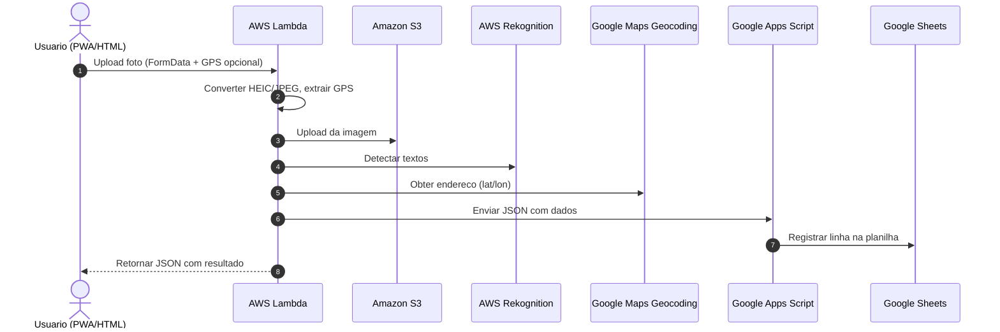

# 📸 MVP – Captura e Processamento de Fotos de Imóveis

## 📋 Visão Geral
Este projeto é um **MVP funcional** do projeto principal [**PRECOJA.COM**](https://precoja.com), que permite **capturar uma foto com o celular na rua** e, em poucos segundos, **catalogar automaticamente os dados do imóvel** em uma planilha online.  
O sistema integra **AWS Lambda**, **S3**, **Google Apps Script**, **Google Maps Geocoding API** e **AWS Rekognition**, suportando também imagens **HEIC** (iPhone) e envio direto via **PWA** ou **upload**.

---

## 🎯 Objetivo
O objetivo principal é **automatizar a prospecção de imóveis** encontrados presencialmente, permitindo que o usuário:
- Tire uma foto pelo celular (via PWA ou upload)
- Tenha a imagem processada automaticamente na nuvem
- Registre **coordenadas GPS**, **endereço**, **telefones**, **status** (“Vende” / “Aluga”) e **número do imóvel**
- Salve tudo em uma **planilha online** de forma instantânea
- Possibilite integrações futuras com APIs de disparo de mensagens (ex.: WhatsApp)

---

## 🛠 Tecnologias Utilizadas

### **1. AWS Lambda**
- **Linguagem**: Python 3.x
- **Funções principais**:
  - Recebe imagens via `multipart/form-data` ou `base64`  
  - Conversão de **HEIC → JPEG** usando `pyheif` e `Pillow`  
  - Extração de GPS via **EXIF** (`exifread`)  
  - Fallback para coordenadas via **querystring**
  - Upload para **S3**
  - Detecção de textos via **AWS Rekognition**
  - Extração de telefones com **expressões regulares**
  - Chamada à **Google Maps Geocoding API** para endereço
  - Envio de dados para **Google Apps Script**

---

### **2. Amazon S3**
- Armazena todas as imagens organizadas por **data** no formato `YYYY-MM-DD/nome-arquivo.jpg`
- Permite acesso público via URL para consulta e exibição

---

### **3. Google Apps Script**
- Recebe requisições **HTTP POST** do Lambda
- Registra os dados em uma **Google Spreadsheet**  
- Estrutura da planilha:
  1. Data/Hora
  2. Endereço
  3. Latitude
  4. Longitude
  5. Status (“Vende”, “Aluga”)
  6. Número do imóvel
  7. Telefones
  8. URL da foto

---

### **4. Frontend – HTML + JavaScript (PWA)**
- **Upload** direto de foto ou captura via câmera
- Compressão de imagem no cliente para **1600px** máx.
- Captura de **GPS** em tempo real (atualização contínua)
- Envio via **FormData** para o endpoint da Lambda
- **Modo PWA**:
  - Instalável no celular
  - Prompt de instalação personalizado
  - Instruções específicas para iOS
- Modo **debug** integrado para monitorar logs

---

### **5. Google Maps Geocoding API**
- Utilizada para converter latitude/longitude em **endereço formatado**
- API Key configurada no Lambda

---

## 🔄 Fluxo de Funcionamento



## 📌 Diferenciais do Projeto
- **Integração ponta a ponta** sem necessidade de backend dedicado
- **Processamento em tempo real**
- **Suporte a HEIC** para compatibilidade com iPhones
- **Fallback de localização**:
  - Extração via EXIF
  - Captura via querystring (GPS do navegador)
- **Extração automática de dados relevantes**:
  - Telefones
  - Status do imóvel (vende/aluga)
  - Número da casa
- **Interface mobile-first** com instalação como aplicativo (PWA)
- **Escalabilidade automática** via AWS Lambda
- **Envio direto para planilha** (Google Sheets) sem intermediários

---

## 🔮 Possíveis Extensões
- Integração com API do WhatsApp para disparo automático de mensagens
- Reconhecimento de logotipos e cores para identificar imobiliárias
- Criação de dashboard de visualização e mapa interativo dos imóveis capturados
- Exportação para CRM
- Geração automática de leads com base em critérios (ex.: bairro, preço estimado)
- Integração com serviços de anúncios online

---

## 📂 Estrutura de Pastas
```text
/
├── lambda_mvp_foto/             # Código da AWS Lambda (Python)
│   ├── requirements.txt
│   └── lambda_function.py  # LAMBDA da AWS
├── foto.html           # frontend final do projeto
├── manifest_camptura.json
├── icon-192.png
├── icon-512.png
├── appscript_google.gs # Google APPS Script
├── s3.json             # JSON inicial do bucket criado
├── README.md           # Documentação do projeto
└── live-demo.mp4       # Video demonstracao
```
